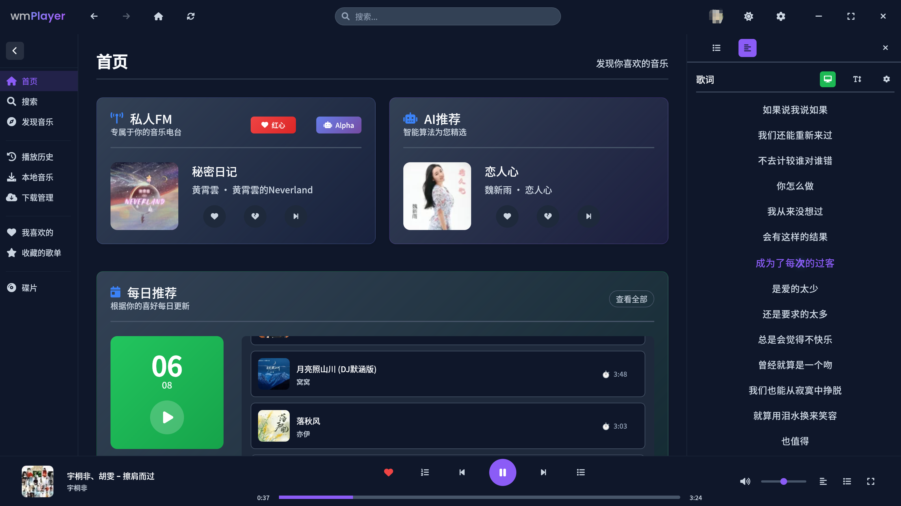
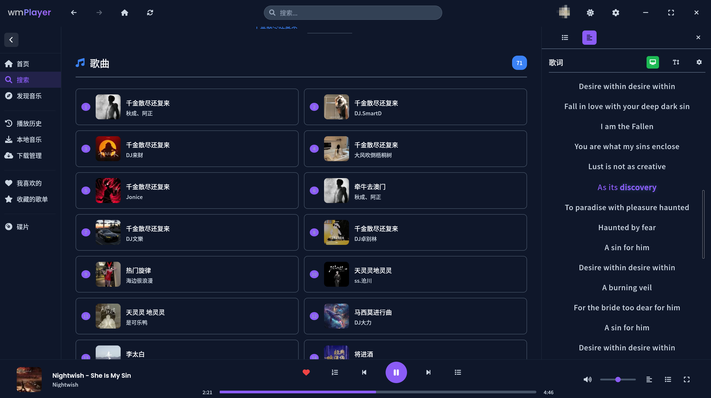
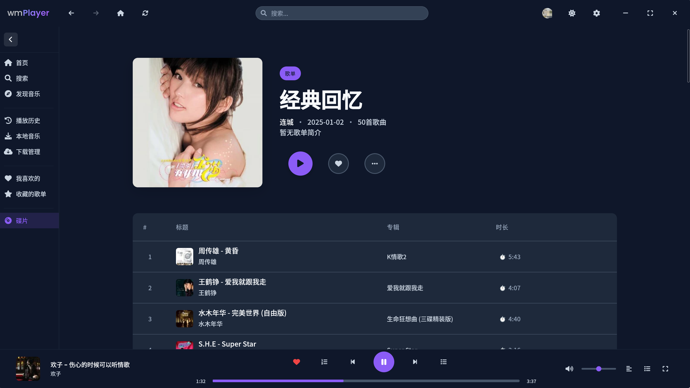
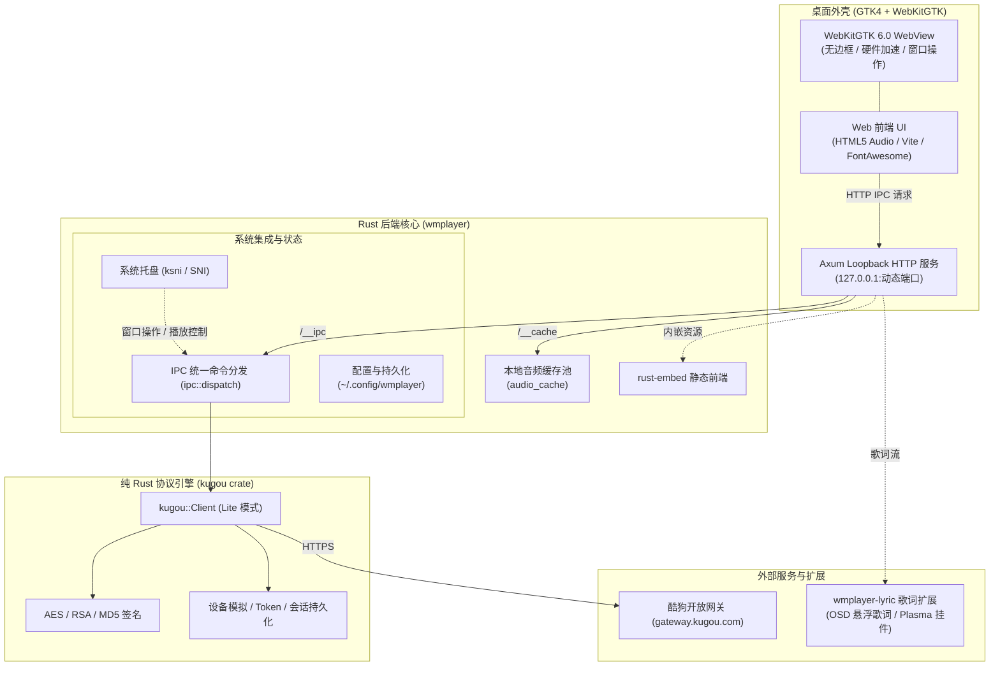

# wmPlayer (lmPlayer) - 基于 Rust + GTK4 / WebKitGTK 的现代化音乐播放器

<div align="center">


一个基于 **Rust** 与 **GTK4 + WebKitGTK 6.0** 构建的高性能现代化音乐播放器。内置纯 Rust 实现的酷狗协议引擎（免除任何外部 Node.js 依赖），支持在线音乐流媒体、高音质无损播放、本地音乐管理、状态栏托盘 (ksni / SNI)、OSD 桌面悬浮歌词与 Linux 桌面环境深度集成。

[](https://www.rust-lang.org/)
[](https://gtk.org/)
[](https://github.com/lianchengwu/lmplayer/releases)
[](https://github.com/lianchengwu/lmplayer/actions)
[](LICENSE)

[功能特性](#-主要特性) • [应用截图](#-应用截图) • [架构设计](#-架构设计) • [快速开始](#-快速开始) • [构建打包](#-构建与打包) • [CI 与发布](#-持续集成与自动化发布) • [目录结构](#-目录结构) • [歌词扩展](#-歌词系统与外部扩展) • [免责声明](#-免责声明)

</div>

---

## 📸 应用截图

<div align="center">

### 主界面主题
| 浅色主题 | 深色主题 |
| :---: | :---: |
|  |  |
| **毛玻璃浅色** | **磨砂深色** |
|  |  |

### 核心功能体验
| 发现音乐 | 全能搜索 |
| :---: | :---: |
|  |  |
| **本地音乐库** | **我喜欢的音乐** |
|  |  |
| **播放历史** | **碟片沉浸播放** |
|  |  |

</div>

---

## ✨ 主要特性

### 🦀 纯 Rust 原生协议引擎 (`kugou` crate)
- **零外部服务依赖**：核心加签算法、设备参数模拟、AES / RSA 加解密与歌词解码完全由纯 Rust 实现，**彻底告别外部 Node.js 进程守护与端口冲突**。
- **开箱即用 & 极速响应**：原生支持酷狗 Lite 协议，包含音质解析（标准 / 高品 / 无损 / Hi-Fi）、关键词联想搜索、新歌/飙升榜单、歌单详情、个性化 FM、青年专区推荐以及扫码登录与会话持久化。
- **单二进制自包含**：Release 编译时前端静态资源由 `rust-embed` 编译进单一可执行文件，开箱运行，无多余散落依赖。

### 🎨 现代化界面与沉浸式体验
- **现代化无边框设计**：GTK4 原生无边框窗口，支持平滑拖拽移动、双击最大化与多屏自适应。
- **离线化资产打包**：全量 FontAwesome 图标及 WebFonts 字体资产实现本地化打包，在断网及离线环境下界面图标 100% 正常渲染。
- **沉浸式黑胶唱片模式**：支持黑胶唱片旋转动效、动态封面模糊背景，以及流畅平滑滚动的逐字变色高亮歌词。
- **四套精心打磨的主题**：浅色、深色、毛玻璃浅色、磨砂深色，一键无缝即时切换。

### 📂 本地音乐管理与智能音频缓存
- **本地音乐管理**：支持本地音频文件快速扫描、解析与直接播放，提供本地播放列表、收藏夹与播放历史记录管理。
- **本地音频缓存池**：内置本地音频文件缓存管理（`~/.cache/wmplayer/cache/`），已播放音频智能缓存复用，大幅减少带宽开销，实现毫秒级拖拽快进与即刻起播。

### 🐧 Linux 桌面生态深度集成
- **GTK4 + WebKitGTK 6.0**：采用现代 Linux 桌面图形栈，支持原生硬件加速策略切换；针对 NVIDIA 驱动环境自动规避 WebKitGTK DMA-BUF 渲染卡顿。
- **StatusNotifierItem 系统托盘 (ksni)**：无缝适配 KDE Plasma、GNOME 等桌面环境的托盘规范，支持后台常驻、托盘播放/暂停、上一曲/下一曲、歌曲收藏与 OSD 歌词开关。
- **MPRIS 与多媒体按键**：支持 Linux MPRIS 多媒体控制规范与键盘全局多媒体快捷键响应。

### 🎤 独立歌词系统 (OSD & Plasma)
- **多格式歌词解析**：支持标准 LRC 歌词与逐字高亮 KRC 歌词解码。
- **跨进程歌词广播**：支持将实时歌词流广播给外部独立歌词进程。
- **独立 OSD 桌面歌词**：配套支持透明度调节 (`0.01` ~ `0.90`)、字体缩放 (`12px` ~ `48px`)、卡拉 OK 逐字高亮色彩自定义与窗口锁定。
- **KDE Plasma 桌面挂件**：深度适配 Linux KDE Plasma 桌面环境。

---

## 🏛️ 架构设计

wmPlayer 采用 **GTK4/WebKitGTK 桌面外壳 + Axum 回环服务端 + 纯 Rust 协议引擎** 的分层架构：



---

## 🚀 快速开始

### 📋 环境要求

- **Rust**: `1.75.0` 或更高版本（Rust 2021 Edition）
- **Node.js**: `v18.0.0` 或更高版本（推荐 `v20+`）
- **操作系统与系统依赖**：
  - **Ubuntu / Debian**:
    ```bash
    sudo apt update
    sudo apt install -y pkg-config libgtk-4-dev libwebkitgtk-6.0-dev libsoup-3.0-dev
    ```
  - **Arch Linux / Manjaro**:
    ```bash
    sudo pacman -S gtk4 webkit6gtk libsoup3 pkgconf
    ```
  - **Fedora**:
    ```bash
    sudo dnf install gtk4-devel webkit6gtk-devel libsoup3-devel pkgconf
    ```
  - **openSUSE**:
    ```bash
    sudo zypper in gtk4-devel webkit2gtk-6.0-devel libsoup-devel pkg-config
    ```

---

### 💻 本地开发

```bash
# 1. 克隆项目仓库
git clone https://github.com/lianchengwu/lmplayer.git
cd lmplayer

# 2. 安装前端依赖并构建前端产物
cd frontend && npm install && npm run build && cd ..

# 3. 启动开发模式
cargo run --bin wmplayer
```

---

### 📦 构建与打包

```bash
# 方式一：直接运行项目提供的一键构建脚本
./build.sh

# 方式二：手动构建
cd frontend && npm run build && cd ..
cargo build --release --bin wmplayer

# 构建产物位于：
target/release/wmplayer
```

> [!NOTE]
> 在 Release 构建模式下，`build.rs` 会自动检查并在缺少时触发前端构建，通过 `rust-embed` 将 `frontend/dist` 资源直接嵌入最终的独立二进制文件中。

---

## 🤖 持续集成与自动化发布

本项目配置了 **GitHub Actions CI 流水线** (`.github/workflows/build.yml`)：

### 自动化发布流程
只需向仓库推送以 `v` 开头的版本标签（例如 `v0.7.0`），CI 将自动完成编译、打包并创建 GitHub Release 发布：

```bash
git tag v0.7.0
git push origin v0.7.0
```

| 平台 | 架构 | 生成产物 | 说明 |
| :--- | :--- | :--- | :--- |
| **Linux** | x86_64 | `wmplayer-linux-amd64.tar.gz` | 单一自包含可执行程序（内嵌 WebUI 与纯 Rust 协议引擎） |
| **Windows** | x86_64 | `kugou` crate 单元测试与库构建 | 纯 Rust 协议库跨平台编译验证 |

---

## 🎵 歌词系统与外部扩展

wmPlayer 提供了与外部独立歌词进程进行联动的扩展能力，并配套开源了独立的桌面悬浮歌词与 KDE 桌面插件：

* **歌词扩展开源仓库**：👉 [wmplayer-lyric](https://github.com/lianchengwu/wmplayer-lyric)

### 🖥️ OSD 桌面悬浮歌词
独立的桌面透明悬浮歌词程序，支持：
- 透明度调节 (`0.01` ~ `0.90`)
- 字体缩放 (`12px` ~ `48px`)
- 文字颜色、卡拉 OK 逐字高亮色彩自定义
- 窗口锁定/解锁、自由拖拽移动和调整尺寸

```bash
# 编译并运行 OSD 桌面歌词
git clone https://github.com/lianchengwu/wmplayer-lyric.git
cd wmplayer-lyric/osdlyric
make
./osd_lyrics
```

### 🎨 KDE Plasma 桌面歌词挂件
专为 Linux KDE Plasma 桌面环境打造的桌面小部件：
- 无缝嵌入 Plasma 任务栏或桌面
- 支持卡拉 OK 动态变色与自适应桌面主题
- 超低系统资源占用与丝滑平移动画

```bash
# 安装 KDE Plasma 桌面歌词插件
cd wmplayer-lyric/plasma-lyrics
./install.sh
```

---

## 📁 目录结构

```text
lmplayer/
├── .github/
│   └── workflows/
│       └── build.yml                # GitHub Actions 跨平台 CI 构建流水线
├── archify/                         # 运行时架构说明与可视化检查文件
│   └── wmplayer-runtime.architecture.json
├── frontend/                        # 现代 Web 前端源码
│   ├── index.html                   # 主界面骨架
│   ├── app.js / main.js             # 界面业务逻辑与模块分发
│   ├── homepage.js / search.js ...  # 首页推荐、全能搜索等各交互模块
│   ├── unified-player-controller.js # 统一播放状态控制器
│   ├── html5-audio-player-unified.js# HTML5 音频引擎核心
│   ├── bindings/                    # 前端与 Rust 后端 HTTP IPC 适配层
│   └── public/                      # 主题样式表、本地化离线字体与图标资源
├── kugou/                           # 纯 Rust 酷狗音乐协议引擎 (Path Crate)
│   ├── Cargo.toml
│   └── src/
│       ├── api/                     # 歌曲 URL、搜索、歌词、榜单、歌单、登录接口
│       ├── proto/                   # AES、RSA、加签、设备参数模拟、歌词解码
│       ├── client.rs                # 高性能 Lite 客户端实现
│       └── session.rs               # Token 与会话状态持久化
├── src/                             # wmPlayer 桌面应用后端
│   ├── bin/
│   │   └── wmplayer.rs              # GTK4 + WebKitGTK 桌面外壳、Axum 回环服务与系统托盘
│   ├── app.rs                       # 播放器核心状态机
│   ├── audio_cache.rs               # 本地音频缓存池管理
│   ├── home.rs                      # 推荐流、个性化 FM 与音质 URL 调度
│   ├── ipc.rs                       # IPC 统一命令分发与配置持久化
│   ├── login.rs                     # 扫码登录与用户状态服务
│   ├── search.rs                    # 音乐搜索与关键词联想
│   └── lib.rs                       # 核心模块导出与统一错误类型
├── Cargo.toml                       # Rust 主包与依赖配置
├── build.rs                         # 自动化触发前端编译与资源嵌入
├── build.sh                         # 一键编译脚本 (前端 + Rust Release)
├── icon.ico                         # 应用图标
├── image/                           # 文档截图资源
└── README.md                        # 项目说明文档
```

---

## 🔧 运行与配置说明

### 数据与配置存储路径
应用遵循 XDG 跨平台规范自动管理存储目录：
* **配置文件及状态**：`~/.config/wmplayer/`
  - `settings.json`：全局偏好设置（如硬件加速开关等）
  - `cookies.json`：登录认证状态与安全凭据
  - `favorites.json`：我喜欢的音乐
  - `play-history.json`：播放历史记录
  - `local-playlists.json`：本地播放列表
* **音频缓存目录**：`~/.cache/wmplayer/cache/`

### 环境变量说明
* `WEBKIT_DISABLE_DMABUF_RENDERER`：默认在启动时设为 `1`，规避部分 NVIDIA 专有驱动下 WebKitGTK 窗口输入卡死问题。若需自定义可显式覆盖设置。

---

## 📄 许可证

本项目采用 **GPL-3.0** 许可证开源 - 查看 [LICENSE](LICENSE) 文件了解完整详情。

---

## ⚠️ 免责声明

### 关于本项目
- 本程序是基于公开接口与协议研究开发的第三方跨平台客户端，**并非官方客户端**；
- 如需更完善的功能与官方技术支持，请下载[酷狗音乐官方客户端](https://www.kugou.com/)体验。

### 使用声明
- 本项目**仅供个人学习与编程技术研究使用**，请尊重音乐版权；
- **严禁**将本项目用于任何商业盈利活动或非法用途；
- 音乐平台创作不易，请尊重版权，**支持正版**。

### 版权声明
- 使用本项目的过程中可能会产生网络版权数据，**本项目不拥有任何音频及图文内容的所有权**；
- 为避免侵权风险，使用者**务必在 24 小时内**清除使用本项目的过程中所产生的缓存与版权数据。

### 其他说明
- 本项目**不接受**任何形式的商业合作、广告赞助或商业捐赠；
- 如官方音乐平台对本项目有任何异议，请通过 GitHub Issues 联系我们，我们将积极配合处理。

---

## 🙏 致谢

- [Rust](https://www.rust-lang.org/) - 兼具高性能与内存安全的系统编程语言
- [GTK4](https://gtk.org/) & [WebKitGTK](https://webkitgtk.org/) - 现代 Linux 桌面 UI 与 Web 引擎
- [Axum](https://github.com/tokio-rs/axum) & [Tokio](https://tokio.rs/) - 快速轻量的异步网络运行时与框架
- [Font Awesome](https://fontawesome.com/) - 丰富完备的矢量图标库
- [wmplayer-lyric](https://github.com/lianchengwu/wmplayer-lyric) - 配套桌面悬浮歌词与 Plasma 插件系统

---

## 💬 交流群组

- **Telegram 群组**：[加入讨论交流](https://t.me/+EzW5VV8YtOhhMjQ1)

---

<div align="center">

**如果 wmPlayer 对你有帮助，欢迎点亮右上角的 ⭐️ Star 支持本项目！**
</div>
